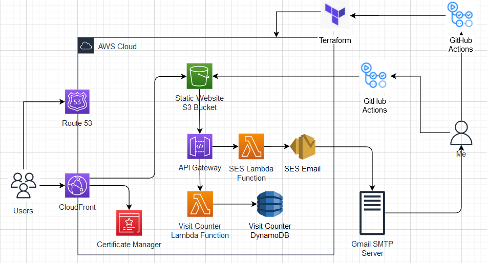
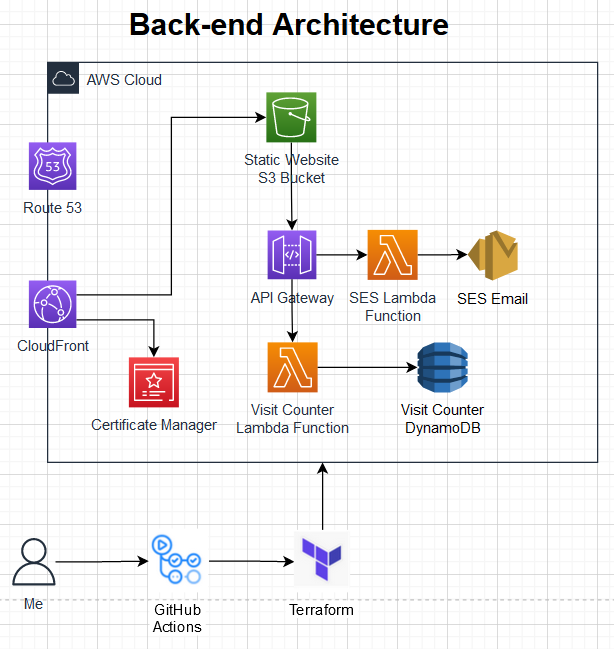

# Backend Infrastructure of my AWS Resume

## Project introduction

The [AWS Resume Challenge](https://cloudresumechallenge.dev/docs/the-challenge/aws/), created by [Forrest Brazeal](https://www.linkedin.com/in/forrestbrazeal), has given me the opportunity to create a resume/portfolio web application on AWS. The challenge consisted of building a personal resume website that would increment the number of users that have visited the page. It also consisted of a backend in which I have created to automate the entire devlopment process using CI/CD and Infrastructure as Code.

## Building the backend infrastructure

In this README, I will go over how I created the backend for the AWS Resume Challenge. The main part of the backend portion of the challenge was to implement an API in which will increment the number of users visited on the webpage to DynamoDB.

  

<!--  -->

#### User Counter

1. A javascript is written on the webpage in which triggers an API everytime the page is loaded. The REST API is used to call a user counter lambda function.
2. The lambda function is written in python and uses the boto3 library. I had to apply the appropriate IAM role for the function in order for it to communicate with DynamoDB.
3. When the function is triggered by the API, it increments the user visited value in the DynamoDB by 1 and will display the amount of users visited on the webpage.

#### Email Contact Form

1. The javascript takes in the contact form values which is sent to a different API. The API takes in those values and sends it over to a Lambda function which will generate the formatted message.
2. The Lambda function takes those values and creates a message that is sent to my email. Since I use google, I had to implement their SMTP server so that the sending email actually sends the message.
3. All of this information is sent to Amazon Simple Email Service (SES) allowing the emails being sent from a sender, to the receiver email(me).

## Summary

Here’s the frontend/portflio: [brandonhang.co](https://brandonhang.co)

I thought that this part of the challenge was pretty difficult. Incorportaing the lambda functions were fairly easy, but trying to automate everything using terraform and github actions was some thing that was new to me. I believe that the learning process was very helpful and the thought of developing the IaC skills will be essential in my career. Although the email form wasn't apart of the challenge, I wanted to add the extra bonus to my website and gain more insight on lambda and other possible AWS services. This challenge has taught me a lot and I hope to implement some these practices into future projects or work.

Thanks for reading! I have the frontend portion of this project linked in this [repository](https://github.com/Brandhang34/crc-frontend)
